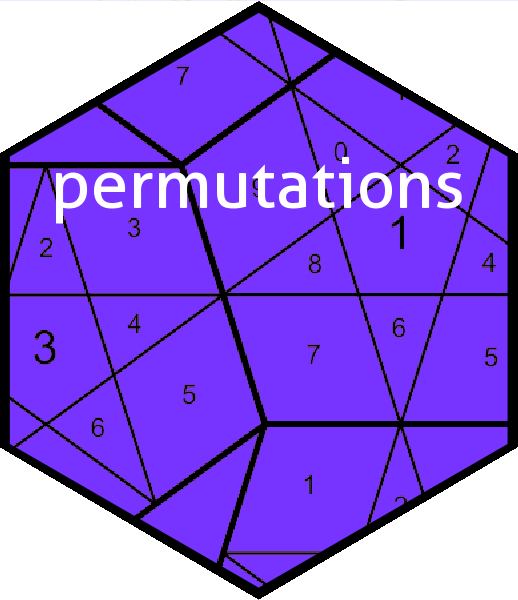

Group theory in R: the permutations package
================

<!-- README.md is generated from README.Rmd. Please edit that file -->

# 

<!-- badges: start -->

[](https://cran.r-project.org/package=permutations)
<!-- badges: end -->

# Overview

The permutations package provides R-centric functionality for working
with permutations of a finite set. It includes group-theoretic
composition of permutations and can transform from word form to cycle
form and back.

# Installation

You can install the released version of permutations from
[CRAN](https://CRAN.R-project.org) with:

``` r
# install.packages("permutations")  # uncomment this to use the package
library("permutations")
#> 
#> Attaching package: 'permutations'
#> The following object is masked from 'package:stats':
#> 
#>     cycle
```

The package is maintained on
[github](https://github.com/RobinHankin/permutations).

# The `permutations` package in use

Random permutations on a finite set are given by the `rperm()` command:

``` r
(x <- rperm(10,9))
#>  [1] (19524)(37)    (1238794)      (1745682)(39)  (15)(3897)(46) (132654789)   
#>  [6] (17263)(59)    (136)(47589)   (162)(4795)    (14763)(259)   (168347925)   
#> [coerced from word form]
```

Above, object `x` is internally stored as a matrix (word form) but the
result is printed in cycle form by default, as this is easier to
understand. We can print in word form if we wish:

``` r
options(print_word_as_cycle=FALSE)  # override default
as.word(x)
#>      {1} {2} {3} {4} {5} {6} {7} {8} {9}
#> [1]  9   4   7   1   2   .   3   .   5  
#> [2]  2   3   8   1   .   .   9   7   4  
#> [3]  7   1   9   5   6   8   4   2   3  
#> [4]  5   .   8   6   1   4   3   9   7  
#> [5]  3   6   2   7   4   5   8   9   1  
#> [6]  7   6   1   .   9   3   2   .   5  
#> [7]  3   .   6   7   8   1   5   9   4  
#> [8]  6   1   .   7   4   2   9   .   5  
#> [9]  4   5   1   7   9   3   6   .   2  
#> [10] 6   5   4   7   1   8   9   3   2
options(print_word_as_cycle=TRUE)  # restore default: we usually want to print a cycle irregardless
```

(A dot indicates a fixed point). The package uses arithmetic operations
`*` to combine permutations and `^` for conjugation:

``` r
(a <- as.word(c(4,2,3,1,5,7,6)))
#> [1] (14)(67)
#> [coerced from word form]
(b <- as.cycle(1:4))
#> [1] (1234)
a*b
#> [1] (234)(67)
#> [coerced from word form]
b*a
#> [1] (123)(67)
#> [coerced from word form]
```

# The megaminx

The *megaminx* is a dodecahedral puzzle with similar construction to the
Rubik cube puzzle that has 50 movable pieces and 132 coloured stickers
(“facets”). The permutations package includes functionality to simulate
the megaminx and exhibits an 82-turn superflip. The vignette gives an
extended discussion.
